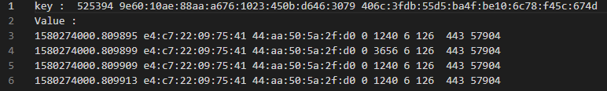
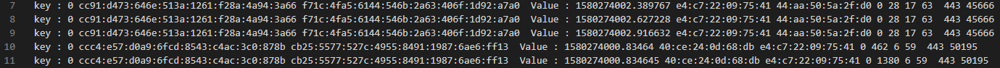

# 存储层部署与使用

- [存储层部署与使用](#存储层部署与使用)
  - [**Part1:TiDB部署**](#part1tidb部署)
    - [1.软硬件配置需求](#1软硬件配置需求)
    - [2.在中控机上部署 TiUP 组件](#2在中控机上部署-tiup-组件)
      - [2.1 执行如下命令安装 TiUP 工具：](#21-执行如下命令安装-tiup-工具)
      - [2.2 声明全局环境变量](#22-声明全局环境变量)
      - [2.3 安装 TiUP cluster 组件](#23-安装-tiup-cluster-组件)
    - [3. 设置集群拓扑并部署](#3-设置集群拓扑并部署)
      - [3.1 集群拓扑设置](#31-集群拓扑设置)
      - [3.2 检查集群存在的潜在风险](#32-检查集群存在的潜在风险)
      - [3.3 部署 TiDB 集群](#33-部署-tidb-集群)
      - [3.4.  替换TiKV实现](#34--替换tikv实现)
  - [**Part2: client-go**](#part2-client-go)
    - [1. client-go配置](#1-client-go配置)
      - [1.1 client-go下载](#11-client-go下载)
      - [1.2 leveldb的安装配置（为 2.2自定义键值查询功能 所依赖）](#12-leveldb的安装配置为-22自定义键值查询功能-所依赖)
      - [1.3 ToCSR的安装配置（为 2.3图存储功能 所依赖）](#13-tocsr的安装配置为-23图存储功能-所依赖)
    - [2. client-go用法](#2-client-go用法)
      - [2.1 原生client-go用法](#21-原生client-go用法)
      - [2.2 自定义键值查询API用法](#22-自定义键值查询api用法)
    - [2.3 图存储API用法](#23-图存储api用法)
  - [**Part3: SQL使用**](#part3-sql使用)


## **Part1:TiDB部署**

> 此阶段部署TiDB集群，内部包含TiKV集群和一个SQL Server(TiDB server)。使用时可以绕过TiDB server，直接使用TiKV集群进行键值存储；也可以通过TiDB server实现SQL访问。如同时需要键值存储和SQL存储，建议部署两个TiDB集群分别提供对应功能。

### 1.软硬件配置需求

[TiDB 软件和硬件环境建议配置 | PingCAP Docs](https://docs.pingcap.com/zh/tidb/stable/hardware-and-software-requirements)

[TiDB 环境与系统配置检查 | PingCAP Docs](https://docs.pingcap.com/zh/tidb/stable/check-before-deployment)

### 2.在中控机上部署 TiUP 组件

>  TiUP 组件是集群部署与管理工具。

#### 2.1 执行如下命令安装 TiUP 工具：

```sh
curl --proto '=https' --tlsv1.2 -sSf https://tiup-mirrors.pingcap.com/install.sh | sh
```

#### 2.2 声明全局环境变量

```shell
source .bash_profile
```

检查

```shell
which tiup
```

#### 2.3 安装 TiUP cluster 组件

```sh
tiup cluste
```

如果已经安装，则更新 TiUP cluster 组件至最新版本：

```sh
tiup update --self && tiup update cluster
```

检查

```sh
tiup --binary cluster
```


### 3. 设置集群拓扑并部署

#### 3.1 集群拓扑设置

>  需要结合具体系统环境与业务需求进行配置,为了方便功能测试开发，这里提供一个经过测试的单机三节点配置文件，修改对应用户后（ssh的用户名）可以直接部署。

[TIKV_Deploy_Assets/topology.yaml](./TIKV_Deploy_Assets/topology.yaml)


#### 3.2 检查集群存在的潜在风险

> -- user参数需要与拓扑配置文件中保持一致，并保证不同节点间此用户的ssh连接。

```sh
tiup cluster check ./topology.yaml --user root [-p] [-i /home/root/.ssh/gcp_rsa]
```

自动修复集群存在的潜在风险

```shell
tiup cluster check ./topology.yaml --apply --user root [-p] [-i /home/root/.ssh/gcp_rsa]
```

#### 3.3 部署 TiDB 集群

```shell
tiup cluster deploy tidb-test v5.4.0 ./topology.yaml --user root [-p] [-i /home/root/.ssh/gcp_rsa]
```

> - `tidb-test` 为部署的集群名称。
> - `v5.4.0` 为部署的集群版本，可以通过执行 `tiup list tidb` 来查看 TiUP 支持的最新可用版本

执行如下命令检查 `tidb-test` 集群情况：

```shell
tiup cluster display tidb-test
```

启动集群

```shell
tiup cluster start tidb-test
```

#### 3.4.  替换TiKV实现

> 此部分待中科大部分后续调优，后续提供脚本支持一键替换，不影响任何接口和上层实现。因此可以先基于上述部署的集群进行开发测试。

替换脚本[TIKV_Deploy_Assets/replace_tikv.sh](./TIKV_Deploy_Assets/replace_tikv.sh)


## **Part2: client-go**

> 通过对原生的client-go进行修改，不仅包含原有的TiKV接口，同时支持包括自定义键值存储、图存储的相关功能。

### 1. client-go配置

#### 1.1 client-go下载

- [client-go 地址（选择 v3.0.5 之后的版本）](https://github.com/JK1Zhang/client-go/tags)
> 使用 `go get -u github.com/JK1Zhang/client-go/v3@v3.0.5` 下载client-go

#### 1.2 leveldb的安装配置（为 2.2自定义键值查询功能 所依赖）
- 文件夹leveldb、snappy即为编译好之后的头文件和动态库，下载之后安装到指定目录即可，路径配置方法见2.2。

#### 1.3 ToCSR的安装配置（为 2.3图存储功能 所依赖）
- 可执行文件ToCSR即为打包好的程序，下载以后可以直接安装到系统目录下，使用 `sudo install ./ToCSR /usr/local/bin`安装即可，其中./ToCSR 为可执行文见ToCSR的下载位置，可以根据需要替换

### 2. client-go用法
> 以下API可以参考client-go项目中的example文件夹。注意连接到集群中的PD server对应ip与端口。

#### 2.1 原生client-go用法

- [Raw KV API Usage](https://github.com/tikv/client-go/wiki/RawKV-Basic)

#### 2.2 自定义键值查询API用法

- >Custom KV API 用法示例 : [examples](https://github.com/JK1Zhang/client-go/blob/v3/examples/rawkv/rawkv.go)
- >使用API之前需要配置环境（声明leveldb库等文件的位置），使用前运行 `source env1.sh`配置环境，其中`$dirpath`为leveldb、snappy文件夹所在目录，需要自己更改

- `ldb.LdbLoadLSM(cli, dbName, startkey, endkey, flowIDPart)` 取两个时间戳内的所有数据，并以流 ID 为 key 重新生成键值存储
    - 时间戳范围为[startkey, endkey]，闭区间
    - dbName 为leveldb数据库的位置路径，例`"./dbtest1"`
    - 流 ID 需要指定选择哪些组成元素，给出元素下标
    - 数据组成如下，时间戳不算在内，比如说下标[3, 7, 8]为`[ipv6.fl, ipv6.dst, ipv6.src]`
    - `[Timestamp, ether.dst, ether.src, ipv6.tc, ipv6.fl, ipv6.plen, ipv6.nh, ipv6.hlim, ipv6.dst, ipv6.src, sport, dport]`

```go
      import (
        "github.com/JK1Zhang/client-go/v3/ldb"
      )

      dbName := "./dbTest1"
      startkey := "1580274000.809441"
      endkey := "1580274003.012248"
      flowIDPart := []int{3, 7, 8} //流 ID 由 [ipv6.fl, ipv6.dst, ipv6.src]组成
      ldb.LdbLoadLSM(cli, dbName, startkey, endkey, flowIDPart)
```

- `ldb.LdbGet(dbName, key)`  根据流 ID（与上述ID组成一致） 获取对应的 KV 对

```go
      key := "525394 9e60:10ae:88aa:a676:1023:450b:d646:3079 406c:3fdb:55d5:ba4f:be10:6c78:f45c:674d"
      val, err := ldb.LdbGet(dbName, key)
      if err != nil {
        // ... handle error ...
        fmt.Printf("get key  from db error\n")
      }
```
> get结果如下，key `[ipv6.fl, ipv6.dst, ipv6.src]` 为选择的元素按照上述顺序以空格分隔组成，value `[Timestamp, ether.dst, ether.src, ipv6.tc, ipv6.plen, ipv6.nh, ipv6.hlim, sport, dport]`为余下元素按照顺序以空格分隔组成



- `ldb.LdbScan(dbName, startID, endID)` 获取两个流 ID 区间内(字母序)的所有数据

```go
      startID := "0 cc91:d473:646e:513a:1261:f28a:4a94:3a66 f71c:4fa5:6144:546b:2a63:406f:1d92:a7a0"
      endID := "525394 9e60:10ae:88aa:a676:1023:450b:d646:3079 406c:3fdb:55d5:ba4f:be10:6c78:f45c:674d"

      keys, vals, err := ldb.LdbScan(dbName, startID, endID)
      if err != nil {
        // ... handle error ...
        fmt.Printf("get key  from db error\n")
      }
```

> scan结果如下，key `[ipv6.fl, ipv6.dst, ipv6.src]` 为选择的元素按照上述顺序以空格分隔组成，value `[Timestamp, ether.dst, ether.src, ipv6.tc, ipv6.plen, ipv6.nh, ipv6.hlim, sport, dport]`为余下元素按照顺序以空格分隔组成




### 2.3 图存储API用法

- `ldb.GetGraph(cli, startTime, endTime)`  直接调用上述函数即可在当前工作目录新建CSR文件夹，并将结果文件写到里面。
  - 上述[startTime，endTime]，代表时间戳的范围，同样是闭区间


## **Part3: SQL使用**
兼容 MySQL(5.6、5.7) 的所有连接器和 API，详情参考。使用时链接到TiDB server与端口。
https://www.mianshigee.com/tutorial/pingcap-docs-cn/sql-connection-and-APIs.md